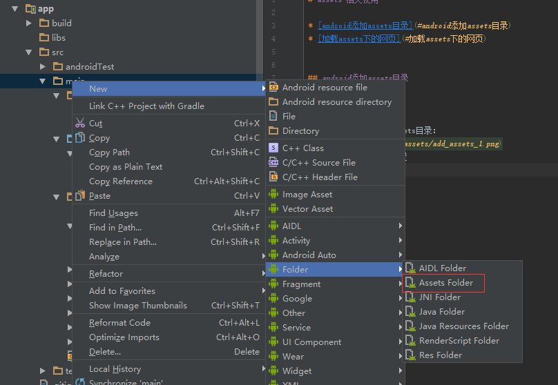

# assets 相关使用

* [android添加assets目录](#android添加assets目录)
* [加载assets下的网页](#加载assets下的网页)
* [访问assets目录下的资源文件](#访问assets目录下的资源文件)
* [获取assets目录下所有文件名](#获取assets目录下所有文件名)
* [获取assets目录下的图片资源](#获取assets目录下的图片资源)
* [获取assets目录下的音乐资源](#获取assets目录下的音乐资源)
* [复制assets目录下的资源文件到SD卡中](#复制assets目录下的资源文件到sd卡中)


## android添加assets目录

1. 第一种方法：  

直接在src/main下新建assets目录：  
  
需要注意的是assets的位置

2. 第二种方法：  

通过向导添加  


## 加载assets下的网页

在webView的loadUrl中添加路径file:///android_asset/
```
webView.loadUrl("file:///android_asset/index.html");
```

## 访问assets目录下的资源文件

需要调用getAssets().open(String fileName);
```
getAssets().open("index.html");
```
返回是InputSteam类型的字节流，fileName只能是文件，不能是文件夹

如果需要将input Stream类型转换成字符串：
```
/**
 * 将InputStream转换成某种字符编码的String
 * @param in
 * @param encoding
 * @return
 * @throws Exception
 */
public static String nputStreamTOString(InputStream in,String encoding) throws Exception{

    ByteArrayOutputStream outStream = new ByteArrayOutputStream();
    byte[] data = new byte[1024 * 4];
    int count = -1;
    while((count = in.read(data,0,1024 * 4)) != -1)
        outStream.write(data, 0, count);

    data = null;
    return new String(outStream.toByteArray(),encoding);
}
```


## 获取assets目录下所有文件名
需要调用getAssets().list(String path);
```
String[] fileNames = getAssets().list("");
```
返回的是所有文件名称的数组，path是assets目录下文件夹地址，如果是根目录则直接添加空字符串即可


## 获取assets目录下的图片资源
需要获取文件的inputStream，然后通过BitmapFactory的decodeStream方法获得Bitmap
```
InputStream inputStream = getAssets().open("add_assets_1.png");
Bitmap bitmap = BitmapFactory.decodeStream(inputStream);
```

## 获取assets目录下的音乐资源
需要调用getAssets().openFd(""),获取到的是AssetFileDescriptor类型，然后通过MediaPlayer的setDataSource方法设置音乐的相关参数
```
AssetFileDescriptor assetFileDescriptor = getAssets().openFd("约定.mp3");
mediaPlayer.reset();
mediaPlayer.setDataSource(assetFileDescriptor.getFileDescriptor(), assetFileDescriptor.getStartOffset(), assetFileDescriptor.getLength());
mediaPlayer.prepare();
```


## 复制assets目录下的资源文件到SD卡中
```
/**
 *  从assets目录中复制整个文件夹内容
 *  @param  context  Context 使用CopyFiles类的Activity
 *  @param  oldPath  String  原文件路径  如：/aa
 *  @param  newPath  String  复制后路径  如：xx:/bb/cc
 */
public void copyAssetsFile(Context context, String oldPath, String newPath) {
    try {
        String fileNames[] = context.getAssets().list(oldPath);//获取assets目录下的所有文件及目录名
        if (fileNames.length > 0) {//如果是目录
            File file = new File(newPath);
            file.mkdirs();//如果文件夹不存在，则递归
            for (String fileName : fileNames) {
                copyAssetsFile(context,oldPath + "/" + fileName,newPath+"/"+fileName);
            }
        } else {//如果是文件
            InputStream is = context.getAssets().open(oldPath);
            FileOutputStream fos = new FileOutputStream(new File(newPath));
            byte[] buffer = new byte[1024];
            int byteCount=0;
            while((byteCount=is.read(buffer))!=-1) {//循环从输入流读取 buffer字节
                fos.write(buffer, 0, byteCount);//将读取的输入流写入到输出流
            }
            fos.flush();//刷新缓冲区
            is.close();
            fos.close();
        }
    } catch (Exception e) {
        e.printStackTrace();
    }
}
```

